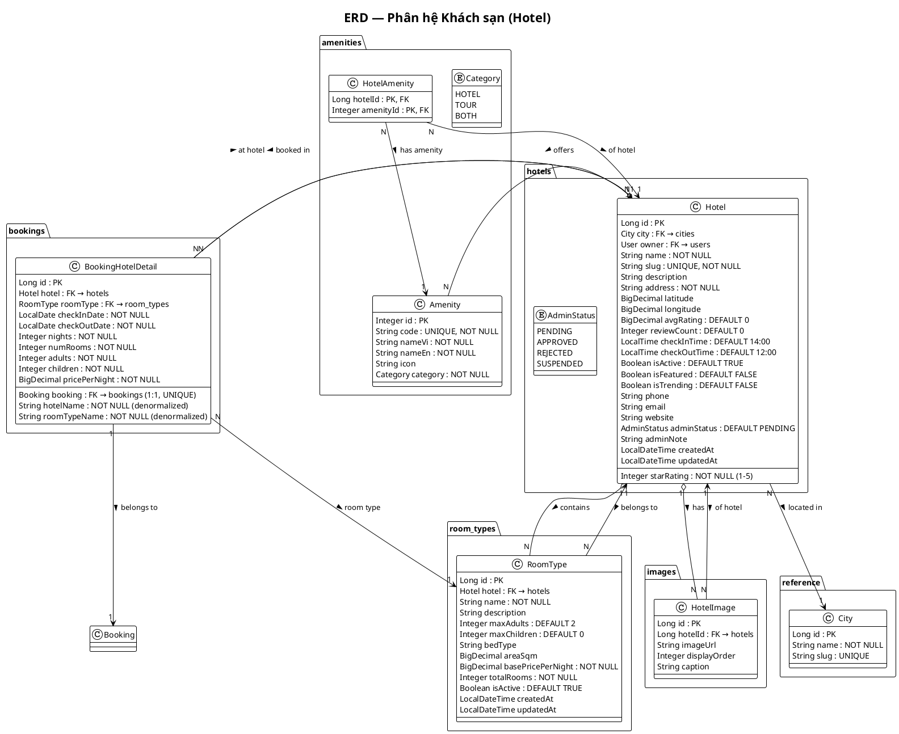

# 3.6.3. Thiết kế bảng Hotel và các bảng liên quan

## 1. Giới thiệu

Phân hệ **Khách sạn** quản lý toàn bộ dữ liệu liên quan đến khách sạn, loại phòng, tiện nghi và đặt phòng. Hệ thống gồm 5 bảng chính: `hotels`, `room_types`, `amenities`, `booking_hotel_details` và bảng trung gian `hotel_amenities`. Thiết kế hỗ trợ nhiều loại phòng cho mỗi khách sạn, đa tiện nghi cho từng khách sạn, và đặt phòng chi tiết theo ngày.

## 2. Sơ đồ quan hệ thực thể (ERD)

```
┌────────────────────────────────────────────────────────────────────┐
│                              hotels                                 │
│────────────────────────────────────────────────────────────────────│
│ PK │ id                 BIGINT UNSIGNED AUTO_INCREMENT              │
│ FK │ city_id            BIGINT UNSIGNED  NOT NULL ─────▶ cities    │
│ FK │ owner_id           BIGINT UNSIGNED ───────────────▶ users     │
│     │ name              VARCHAR(200)       NOT NULL                  │
│     │ slug              VARCHAR(220)       NOT NULL, UNIQUE          │
│     │ description       TEXT                                         │
│     │ address           VARCHAR(300)       NOT NULL                  │
│     │ latitude          DECIMAL(10,7)                               │
│     │ longitude         DECIMAL(10,7)                               │
│     │ star_rating       INT UNSIGNED    NOT NULL  (1–5)            │
│     │ avg_rating        DECIMAL(3,2)     NOT NULL  DEFAULT 0       │
│     │ review_count      INT UNSIGNED     NOT NULL  DEFAULT 0       │
│     │ check_in_time     TIME              NOT NULL  DEFAULT 14:00    │
│     │ check_out_time    TIME              NOT NULL  DEFAULT 12:00   │
│     │ is_active         BOOLEAN          NOT NULL  DEFAULT TRUE     │
│     │ is_featured       BOOLEAN          NOT NULL  DEFAULT FALSE    │
│     │ is_trending        BOOLEAN          NOT NULL  DEFAULT FALSE    │
│     │ phone             VARCHAR(20)                                  │
│     │ email             VARCHAR(150)                                 │
│     │ website           VARCHAR(300)                                 │
│     │ admin_status      ENUM            DEFAULT PENDING             │
│     │                   PENDING | APPROVED | REJECTED | SUSPENDED    │
│     │ admin_note        VARCHAR(500)                                 │
│     │ created_at        DATETIME         NOT NULL                    │
│     │ updated_at        DATETIME         NOT NULL                    │
└────────────────────┬───────────────────────────────────────────────┘
                     │ 1:N
                     ▼
┌────────────────────────────────────────────────────────────────────┐
│                            room_types                               │
│────────────────────────────────────────────────────────────────────│
│ PK │ id                 BIGINT UNSIGNED AUTO_INCREMENT              │
│ FK │ hotel_id           BIGINT UNSIGNED  NOT NULL ─────▶ hotels    │
│     │ name              VARCHAR(100)      NOT NULL                  │
│     │ description       TEXT                                         │
│     │ max_adults        INT UNSIGNED     NOT NULL  DEFAULT 2         │
│     │ max_children      INT UNSIGNED     NOT NULL  DEFAULT 0        │
│     │ bed_type          VARCHAR(50)                                  │
│     │ area_sqm          DECIMAL(6,2)                                 │
│     │ base_price_per_night DECIMAL(12,2) NOT NULL                   │
│     │ total_rooms       INT UNSIGNED     NOT NULL                  │
│     │ is_active         BOOLEAN          NOT NULL  DEFAULT TRUE     │
│     │ created_at        DATETIME         NOT NULL                    │
│     │ updated_at        DATETIME         NOT NULL                    │
└────────────────────┬───────────────────────────────────────────────┘
                     │ 1:N
                     ▼
┌────────────────────────────────────────────────────────────────────┐
│                       booking_hotel_details                         │
│────────────────────────────────────────────────────────────────────│
│ PK │ id                 BIGINT UNSIGNED AUTO_INCREMENT              │
│ FK │ booking_id         BIGINT UNSIGNED  NOT NULL, UNIQUE ─▶ bookings│
│ FK │ hotel_id           BIGINT UNSIGNED  NOT NULL ─────▶ hotels    │
│ FK │ room_type_id       BIGINT UNSIGNED  NOT NULL ─────▶ room_types│
│     │ check_in_date     DATE              NOT NULL                  │
│     │ check_out_date    DATE              NOT NULL                  │
│     │ nights            INT UNSIGNED      NOT NULL                  │
│     │ num_rooms         INT UNSIGNED      NOT NULL                  │
│     │ adults            INT UNSIGNED      NOT NULL                  │
│     │ children          INT UNSIGNED      NOT NULL                  │
│     │ hotel_name        VARCHAR(200)      NOT NULL                  │
│     │ room_type_name    VARCHAR(100)      NOT NULL                  │
│     │ price_per_night   DECIMAL(12,2)     NOT NULL                  │
└────────────────────────────────────────────────────────────────────┘

┌──────────────────────────────────────┐
│           hotel_images                │
│──────────────────────────────────────│
│ PK │ id            BIGINT AUTO       │
│ FK │ hotel_id      BIGINT NOT NULL──▶hotels│
│     │ image_url    VARCHAR(500)       │
│     │ display_order INT UNSIGNED      │
│     │ caption      VARCHAR(255)       │
└──────────────────────────────────────┘

┌──────────────────────────────────────┐    ┌────────────────────────┐
│           amenities                   │    │   hotel_amenities      │
│──────────────────────────────────────│    │────────────────────────│
│ PK │ id            INT UNSIGNED AUTO  │    │ FK │ hotel_id BIGINT  │◀───┐
│     │ code         VARCHAR(30) UNIQUE │    │ FK │ amenity_id INT   │◀───┤
│     │ name_vi      VARCHAR(80) NOT NULL│   └────────────────────────┘    │
│     │ name_en      VARCHAR(80) NOT NULL│         │ N:1                    │
│     │ icon         VARCHAR(100)       │         ▼                        │
│     │ category     ENUM              │   ┌────────────────────────────────┐│
│     │ HOTEL | TOUR | BOTH             │   │ hotels (id)                  ││
└──────────────────────────────────────┘   └────────────────────────────────┘│
                                                                             │
┌──────────────────────────────────────┐   (hotel nhiều amenities)           │
│          cities (bảng tham chiếu)     │                                    │
│──────────────────────────────────────│                                    │
│ PK │ id            BIGINT AUTO        │                                    │
│     │ name         VARCHAR(100)       │                                    │
│     │ slug         VARCHAR(120)       │◀───────────────────────────────────┘
└──────────────────────────────────────┘
```

## 3. Chi tiết thiết kế từng bảng

### 3.1. Bảng `hotels`

| STT | Tên cột | Kiểu dữ liệu | Ràng buộc | Mô tả |
|-----|---------|--------------|-----------|--------|
| 1 | `id` | BIGINT UNSIGNED | **PK**, AUTO_INCREMENT | Khóa chính |
| 2 | `city_id` | BIGINT UNSIGNED | NOT NULL, FK → cities(id) | Thành phố của khách sạn |
| 3 | `owner_id` | BIGINT UNSIGNED | FK → users(id) ON DELETE SET NULL | Chủ sở hữu / đối tác |
| 4 | `name` | VARCHAR(200) | NOT NULL | Tên khách sạn |
| 5 | `slug` | VARCHAR(220) | NOT NULL, **UNIQUE** | Slug URL thân thiện SEO |
| 6 | `description` | TEXT | — | Mô tả chi tiết |
| 7 | `address` | VARCHAR(300) | NOT NULL | Địa chỉ cụ thể |
| 8 | `latitude` | DECIMAL(10,7) | — | Tọa độ vĩ độ (bản đồ) |
| 9 | `longitude` | DECIMAL(10,7) | — | Tọa độ kinh độ (bản đồ) |
| 10 | `star_rating` | INT UNSIGNED | NOT NULL | Số sao (1–5) |
| 11 | `avg_rating` | DECIMAL(3,2) | NOT NULL, DEFAULT 0 | Điểm đánh giá trung bình |
| 12 | `review_count` | INT UNSIGNED | NOT NULL, DEFAULT 0 | Số lượng đánh giá |
| 13 | `check_in_time` | TIME | NOT NULL, DEFAULT '14:00' | Giờ nhận phòng |
| 14 | `check_out_time` | TIME | NOT NULL, DEFAULT '12:00' | Giờ trả phòng |
| 15 | `is_active` | BOOLEAN | NOT NULL, DEFAULT TRUE | Đang hoạt động |
| 16 | `is_featured` | BOOLEAN | NOT NULL, DEFAULT FALSE | Hiển thị nổi bật trên trang chủ |
| 17 | `is_trending` | BOOLEAN | NOT NULL, DEFAULT FALSE | Đang thịnh hành |
| 18 | `phone` | VARCHAR(20) | — | Số điện thoại liên hệ |
| 19 | `email` | VARCHAR(150) | — | Email liên hệ |
| 20 | `website` | VARCHAR(300) | — | Website khách sạn |
| 21 | `admin_status` | ENUM | DEFAULT PENDING | Trạng thái duyệt bởi admin |
| 22 | `admin_note` | VARCHAR(500) | — | Ghi chú của admin khi duyệt/từ chối |
| 23 | `created_at` | DATETIME | NOT NULL | Thời gian tạo |
| 24 | `updated_at` | DATETIME | NOT NULL | Thời gian cập nhật |

**Chỉ mục:** `idx_hotels_slug` (UNIQUE), `idx_hotels_city`, `idx_hotels_star_rating`, `idx_hotels_is_active`, `idx_hotels_admin_status`

### 3.2. Bảng `room_types`

| STT | Tên cột | Kiểu dữ liệu | Ràng buộc | Mô tả |
|-----|---------|--------------|-----------|--------|
| 1 | `id` | BIGINT UNSIGNED | **PK**, AUTO_INCREMENT | Khóa chính |
| 2 | `hotel_id` | BIGINT UNSIGNED | NOT NULL, FK → hotels(id) ON DELETE CASCADE | Khách sạn chứa loại phòng |
| 3 | `name` | VARCHAR(100) | NOT NULL | Tên loại phòng (Standard, Deluxe, Suite...) |
| 4 | `description` | TEXT | — | Mô tả loại phòng |
| 5 | `max_adults` | INT UNSIGNED | NOT NULL, DEFAULT 2 | Số người lớn tối đa |
| 6 | `max_children` | INT UNSIGNED | NOT NULL, DEFAULT 0 | Số trẻ em tối đa |
| 7 | `bed_type` | VARCHAR(50) | — | Loại giường (Single, Double, King...) |
| 8 | `area_sqm` | DECIMAL(6,2) | — | Diện tích phòng (m²) |
| 9 | `base_price_per_night` | DECIMAL(12,2) | NOT NULL | Giá cơ bản mỗi đêm |
| 10 | `total_rooms` | INT UNSIGNED | NOT NULL | Tổng số phòng của loại này |
| 11 | `is_active` | BOOLEAN | NOT NULL, DEFAULT TRUE | Còn kinh doanh không |
| 12 | `created_at` | DATETIME | NOT NULL | Thời gian tạo |
| 13 | `updated_at` | DATETIME | NOT NULL | Thời gian cập nhật |

**Chỉ mục:** `idx_room_types_hotel` trên `hotel_id`

### 3.3. Bảng `amenities`

| STT | Tên cột | Kiểu dữ liệu | Ràng buộc | Mô tả |
|-----|---------|--------------|-----------|--------|
| 1 | `id` | INT UNSIGNED | **PK**, AUTO_INCREMENT | Khóa chính |
| 2 | `code` | VARCHAR(30) | **UNIQUE**, NOT NULL | Mã tiện nghi (WIFI, POOL, SPA...) |
| 3 | `name_vi` | VARCHAR(80) | NOT NULL | Tên tiện nghi (Tiếng Việt) |
| 4 | `name_en` | VARCHAR(80) | NOT NULL | Tên tiện nghi (Tiếng Anh) |
| 5 | `icon` | VARCHAR(100) | — | Icon/emoji hiển thị |
| 6 | `category` | ENUM('HOTEL','TOUR','BOTH') | NOT NULL | Loại áp dụng |

**Dữ liệu mẫu:**

| id | code | name_vi | name_en | icon | category |
|----|------|---------|---------|------|----------|
| 1 | WIFI | WiFi miễn phí | Free WiFi | 📶 | HOTEL |
| 2 | POOL | Hồ bơi | Swimming Pool | 🏊 | HOTEL |
| 3 | SPA | Spa & Massage | Spa & Massage | 💆 | HOTEL |
| 4 | PARKING | Bãi đỗ xe | Free Parking | 🅿️ | HOTEL |
| 5 | BREAKFAST | Bữa sáng | Breakfast | 🍳 | HOTEL |
| 6 | GYM | Phòng gym | Gym | 💪 | HOTEL |
| 7 | RESTAURANT | Nhà hàng | Restaurant | 🍽️ | HOTEL |
| 8 | AIRPORT_PICKUP | Đưa đón sân bay | Airport Pickup | ✈️ | HOTEL |

### 3.4. Bảng `hotel_amenities` (trung gian)

| STT | Tên cột | Kiểu dữ liệu | Ràng buộc | Mô tả |
|-----|---------|--------------|-----------|--------|
| 1 | `hotel_id` | BIGINT UNSIGNED | **PK**, FK → hotels(id) ON DELETE CASCADE | Khóa ngoại đến hotels |
| 2 | `amenity_id` | INT UNSIGNED | **PK**, FK → amenities(id) ON DELETE CASCADE | Khóa ngoại đến amenities |

### 3.5. Bảng `booking_hotel_details`

| STT | Tên cột | Kiểu dữ liệu | Ràng buộc | Mô tả |
|-----|---------|--------------|-----------|--------|
| 1 | `id` | BIGINT UNSIGNED | **PK**, AUTO_INCREMENT | Khóa chính |
| 2 | `booking_id` | BIGINT UNSIGNED | NOT NULL, **UNIQUE** | Đơn đặt phòng liên kết (1:1) |
| 3 | `hotel_id` | BIGINT UNSIGNED | NOT NULL, FK → hotels(id) | Khách sạn đặt |
| 4 | `room_type_id` | BIGINT UNSIGNED | NOT NULL, FK → room_types(id) | Loại phòng đặt |
| 5 | `check_in_date` | DATE | NOT NULL | Ngày nhận phòng |
| 6 | `check_out_date` | DATE | NOT NULL | Ngày trả phòng |
| 7 | `nights` | INT UNSIGNED | NOT NULL | Số đêm lưu trú |
| 8 | `num_rooms` | INT UNSIGNED | NOT NULL | Số phòng đặt |
| 9 | `adults` | INT UNSIGNED | NOT NULL | Số người lớn |
| 10 | `children` | INT UNSIGNED | NOT NULL | Số trẻ em |
| 11 | `hotel_name` | VARCHAR(200) | NOT NULL | Tên khách sạn (denormalized) |
| 12 | `room_type_name` | VARCHAR(100) | NOT NULL | Tên loại phòng (denormalized) |
| 13 | `price_per_night` | DECIMAL(12,2) | NOT NULL | Giá mỗi đêm tại thời điểm đặt |

### 3.6. Bảng `hotel_images`

| STT | Tên cột | Kiểu dữ liệu | Ràng buộc | Mô tả |
|-----|---------|--------------|-----------|--------|
| 1 | `id` | BIGINT | **PK**, AUTO_INCREMENT | Khóa chính |
| 2 | `hotel_id` | BIGINT | NOT NULL, FK → hotels(id) ON DELETE CASCADE | Khách sạn chứa ảnh |
| 3 | `image_url` | VARCHAR(500) | — | URL hình ảnh |
| 4 | `display_order` | INT UNSIGNED | — | Thứ tự hiển thị |
| 5 | `caption` | VARCHAR(255) | — | Chú thích ảnh |

### 3.7. Bảng `cities` (tham chiếu)

| STT | Tên cột | Kiểu dữ liệu | Ràng buộc | Mô tả |
|-----|---------|--------------|-----------|--------|
| 1 | `id` | BIGINT | **PK**, AUTO_INCREMENT | Khóa chính |
| 2 | `name` | VARCHAR(100) | NOT NULL | Tên thành phố |
| 3 | `slug` | VARCHAR(120) | NOT NULL, UNIQUE | Slug URL |

## 4. Sơ đồ PlantUML



## 5. Các ràng buộc toàn vẹn riêng của phân hệ Hotel

| STT | Ràng buộc | Mô tả |
|-----|-----------|--------|
| 1 | `UNIQUE(slug)` trong hotels | Mỗi khách sạn có slug URL duy nhất |
| 2 | `star_rating BETWEEN 1 AND 5` | Số sao chỉ từ 1 đến 5 |
| 3 | `check_out_date > check_in_date` | Ngày trả phòng phải sau ngày nhận phòng |
| 4 | `max_adults >= numRooms * 1` | Tổng khách tối đa phải phù hợp với số phòng |
| 5 | `base_price_per_night > 0` | Giá phòng phải lớn hơn 0 |
| 6 | `total_rooms >= 1` | Mỗi loại phòng phải có ít nhất 1 phòng |
| 7 | `booking.booking_type = 'HOTEL'` khi tạo booking_hotel_details | Chỉ tạo chi tiết đặt phòng cho booking loại HOTEL |
| 8 | `admin_status = 'APPROVED'` mới hiển thị công khai | Hotel bị từ chối hoặc treo không hiển thị |
| 9 | `is_active = TRUE` mới cho phép đặt | Chỉ phòng đang hoạt động mới đặt được |
| 10 | `ON DELETE CASCADE` từ hotel → room_types, hotel_images | Xóa khách sạn sẽ xóa hết phòng và ảnh liên quan |
