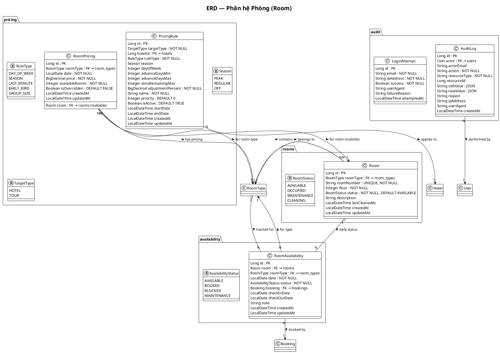

# 3.6.4. Thiết kế bảng Room và các bảng liên quan

## 1. Giới thiệu

Phân hệ **Room (Phòng)** quản lý chi tiết từng phòng cụ thể trong khách sạn, bao gồm trạng thái phòng theo thời gian thực, giá theo mùa/ngày, và nhật ký thay đổi. Hệ thống gồm 3 bảng chính: `rooms`, `room_pricing` và `room_availability`.

> **Lưu ý:** Trong thiết kế hiện tại, khách sạn chỉ quản lý theo `RoomType` với `total_rooms`. Phần này mở rộng thành **quản lý phòng chi tiết** khi cần theo dõi trạng thái từng phòng cụ thể.

## 2. Sơ đồ quan hệ thực thể (ERD)

```
┌──────────────────────────────────────────────────────────────────┐
│                            rooms                                  │
│──────────────────────────────────────────────────────────────────│
│ PK │ id                  BIGINT UNSIGNED AUTO_INCREMENT           │
│ FK │ room_type_id       BIGINT UNSIGNED  NOT NULL ─────▶ room_types│
│     │ room_number       VARCHAR(20)       NOT NULL, UNIQUE         │
│     │ floor             INT UNSIGNED      NOT NULL                  │
│     │ status            ENUM            NOT NULL                  │
│     │ AVAILABLE | OCCUPIED | MAINTENANCE | CLEANING               │
│     │ description       TEXT                                          │
│     │ last_cleaned_at   DATETIME                                      │
│     │ created_at        DATETIME        NOT NULL                    │
│     │ updated_at        DATETIME        NOT NULL                    │
└────────────────────────┬─────────────────────────────────────────┘
                         │ 1:N
                         ▼
┌──────────────────────────────────────────────────────────────────┐
│                         room_pricing                              │
│──────────────────────────────────────────────────────────────────│
│ PK │ id                  BIGINT UNSIGNED AUTO_INCREMENT           │
│ FK │ room_type_id       BIGINT UNSIGNED  NOT NULL ─────▶ room_types│
│ FK │ room_id            BIGINT UNSIGNED  NOT NULL ─────▶ rooms     │
│     │ date              DATE             NOT NULL                  │
│     │ price             DECIMAL(12,2)    NOT NULL                  │
│     │ available_rooms   INT UNSIGNED     NOT NULL                  │
│     │ is_overridden     BOOLEAN          DEFAULT FALSE             │
│     │ created_at        DATETIME        NOT NULL                    │
│     │ updated_at        DATETIME        NOT NULL                    │
└────────────────────────┬─────────────────────────────────────────┘
                         │ 1:N
                         ▼
┌──────────────────────────────────────────────────────────────────┐
│                       room_availability                          │
│──────────────────────────────────────────────────────────────────│
│ PK │ id                  BIGINT UNSIGNED AUTO_INCREMENT           │
│ FK │ room_id            BIGINT UNSIGNED  NOT NULL ─────▶ rooms     │
│ FK │ room_type_id       BIGINT UNSIGNED  NOT NULL ─────▶ room_types│
│     │ date              DATE             NOT NULL                  │
│     │ status            ENUM            NOT NULL                  │
│     │ AVAILABLE | BOOKED | BLOCKED | MAINTENANCE                 │
│     │ booking_id        BIGINT UNSIGNED ────────────▶ bookings     │
│     │ check_in_date    DATE                                          │
│     │ check_out_date   DATE                                          │
│     │ note             VARCHAR(255)                                 │
│     │ created_at        DATETIME        NOT NULL                    │
│     │ updated_at        DATETIME        NOT NULL                    │
└──────────────────────────────────────────────────────────────────┘

┌────────────────────────────────────────────────────────────────┐
│                        pricing_rules                            │
│────────────────────────────────────────────────────────────────│
│ PK │ id                  BIGINT AUTO                             │
│     │ target_type        ENUM ('HOTEL','TOUR') NOT NULL          │
│     │ hotel_id          BIGINT        ───────────────────────────▶hotels│
│     │ rule_type         ENUM NOT NULL                           │
│     │ DAY_OF_WEEK | SEASON | LAST_MINUTE | EARLY_BIRD | GROUP_SIZE│
│     │ season            ENUM (PEAK / REGULAR / OFF)              │
│     │ day_of_week       INT (1–7)                                │
│     │ advance_days_min  INT                                      │
│     │ advance_days_max  INT                                      │
│     │ slots_remaining_max INT                                   │
│     │ adjustment_percent DECIMAL(5,2) NOT NULL                   │
│     │ name              VARCHAR(200)   NOT NULL                  │
│     │ priority          INT UNSIGNED  NOT NULL DEFAULT 0         │
│     │ is_active         BOOLEAN        NOT NULL DEFAULT TRUE     │
│     │ start_date        DATETIME                                     │
│     │ end_date          DATETIME                                     │
│     │ created_at        DATETIME       NOT NULL                    │
│     │ updated_at        DATETIME       NOT NULL                    │
└────────────────────────────────────────────────────────────────┘
```

## 3. Chi tiết thiết kế từng bảng

### 3.1. Bảng `rooms`

| STT | Tên cột | Kiểu dữ liệu | Ràng buộc | Mô tả |
|-----|---------|--------------|-----------|--------|
| 1 | `id` | BIGINT UNSIGNED | **PK**, AUTO_INCREMENT | Khóa chính |
| 2 | `room_type_id` | BIGINT UNSIGNED | NOT NULL, FK → room_types(id) ON DELETE CASCADE | Loại phòng chứa phòng này |
| 3 | `room_number` | VARCHAR(20) | NOT NULL, **UNIQUE** | Số phòng (e.g. "101", "Deluxe-2") |
| 4 | `floor` | INT UNSIGNED | NOT NULL | Tầng của phòng |
| 5 | `status` | ENUM | NOT NULL, DEFAULT AVAILABLE | Trạng thái hiện tại |
| 6 | `description` | TEXT | — | Mô tả đặc biệt (view, tiện nghi riêng) |
| 7 | `last_cleaned_at` | DATETIME | — | Thời điểm dọn phòng cuối |
| 8 | `created_at` | DATETIME | NOT NULL | Thời gian tạo |
| 9 | `updated_at` | DATETIME | NOT NULL | Thời gian cập nhật |

**Trạng thái phòng (status):**

| Giá trị | Mô tả |
|---------|--------|
| AVAILABLE | Phòng trống, sẵn sàng đặt |
| OCCUPIED | Đang có khách |
| MAINTENANCE | Đang bảo trì, sửa chữa |
| CLEANING | Đang dọn dẹp |

**Chỉ mục:** `idx_rooms_number` (UNIQUE), `idx_rooms_type`, `idx_rooms_status`

### 3.2. Bảng `room_pricing`

| STT | Tên cột | Kiểu dữ liệu | Ràng buộc | Mô tả |
|-----|---------|--------------|-----------|--------|
| 1 | `id` | BIGINT UNSIGNED | **PK**, AUTO_INCREMENT | Khóa chính |
| 2 | `room_type_id` | BIGINT UNSIGNED | NOT NULL, FK → room_types(id) | Áp dụng cho loại phòng |
| 3 | `room_id` | BIGINT UNSIGNED | NOT NULL, FK → rooms(id) | Áp dụng cho phòng cụ thể (null = áp dụng cho tất cả) |
| 4 | `date` | DATE | NOT NULL | Ngày áp dụng giá |
| 5 | `price` | DECIMAL(12,2) | NOT NULL | Giá phòng ngày đó |
| 6 | `available_rooms` | INT UNSIGNED | NOT NULL | Số phòng trống ngày đó |
| 7 | `is_overridden` | BOOLEAN | DEFAULT FALSE | Có ghi đè giá mùa không |
| 8 | `created_at` | DATETIME | NOT NULL | Thời gian tạo |
| 9 | `updated_at` | DATETIME | NOT NULL | Thời gian cập nhật |

**Chỉ mục:** `idx_room_pricing_date` trên `(date)`, `idx_room_pricing_type_date` trên `(room_type_id, date)`

### 3.3. Bảng `room_availability`

| STT | Tên cột | Kiểu dữ liệu | Ràng buộc | Mô tả |
|-----|---------|--------------|-----------|--------|
| 1 | `id` | BIGINT UNSIGNED | **PK**, AUTO_INCREMENT | Khóa chính |
| 2 | `room_id` | BIGINT UNSIGNED | NOT NULL, FK → rooms(id) ON DELETE CASCADE | Phòng được theo dõi |
| 3 | `room_type_id` | BIGINT UNSIGNED | NOT NULL, FK → room_types(id) | Loại phòng |
| 4 | `date` | DATE | NOT NULL | Ngày theo dõi |
| 5 | `status` | ENUM | NOT NULL | Trạng thái ngày đó |
| 6 | `booking_id` | BIGINT UNSIGNED | FK → bookings(id) ON DELETE SET NULL | Booking liên kết (nếu đã đặt) |
| 7 | `check_in_date` | DATE | — | Ngày nhận phòng (trong booking) |
| 8 | `check_out_date` | DATE | — | Ngày trả phòng (trong booking) |
| 9 | `note` | VARCHAR(255) | — | Ghi chú (VD: "khách đặt early check-in") |
| 10 | `created_at` | DATETIME | NOT NULL | Thời gian tạo |
| 11 | `updated_at` | DATETIME | NOT NULL | Thời gian cập nhật |

**Chỉ mục:** `idx_room_avail_room_date` trên `(room_id, date)` (UNIQUE), `idx_room_avail_date` trên `(date, status)`

## 4. Sơ đồ PlantUML



## 5. Các ràng buộc toàn vẹn

| STT | Ràng buộc | Mô tả |
|-----|-----------|--------|
| 1 | `UNIQUE(room_number)` | Số phòng không trùng lặp trong toàn hệ thống |
| 2 | `CHECK (status IN ('AVAILABLE','OCCUPIED','MAINTENANCE','CLEANING'))` | Trạng thái phòng chỉ nhận 4 giá trị |
| 3 | `room_availability(room_id, date)` UNIQUE | Mỗi phòng chỉ có 1 bản ghi trạng thái mỗi ngày |
| 4 | `room_pricing(room_id, date)` UNIQUE | Mỗi phòng chỉ có 1 giá ngày |
| 5 | `CHECK (check_out_date > check_in_date)` | Ngày trả phòng phải sau ngày nhận |
| 6 | `room.status ≠ 'OCCUPIED'` khi hủy booking | Phải giải phóng phòng trước khi hủy |
| 7 | `is_overridden = TRUE` thì `room_id` phải NOT NULL | Chỉ ghi đè giá cho phòng cụ thể |
| 8 | `pricing_rule.adjustment_percent BETWEEN -50 AND 200` | Giá không tăng quá 200% hoặc giảm quá 50% |
| 9 | `last_cleaned_at` cập nhật trước khi đổi `status = AVAILABLE` | Phòng phải dọn trước khi cho khách mới |
| 10 | `ON DELETE CASCADE` từ Room → RoomAvailability | Xóa phòng sẽ xóa lịch sử trạng thái |
