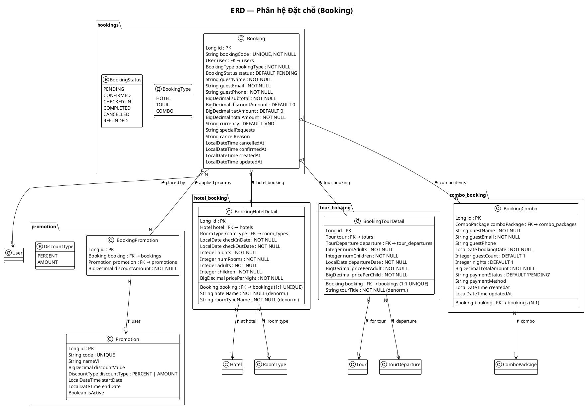

# 3.6.5. Thiết kế bảng Booking và các bảng liên quan

## 1. Giới thiệu

Phân hệ **Booking (Đặt chỗ)** quản lý toàn bộ quy trình đặt dịch vụ từ khách hàng, bao gồm đặt khách sạn, tour, combo. Hệ thống gồm 5 bảng chính: `bookings` (đơn chính), `booking_hotel_details`, `booking_tour_details`, `booking_combos`, và `booking_promotions`. Thiết kế hỗ trợ 3 loại booking (HOTEL, TOUR, COMBO), thanh toán qua nhiều cổng (VNPay, Cash, Bank Transfer), và áp dụng khuyến mãi linh hoạt.

## 2. Sơ đồ quan hệ thực thể (ERD)

```
┌─────────────────────────────────────────────────────────────────────────────┐
│                              bookings                                        │
│─────────────────────────────────────────────────────────────────────────────│
│ PK │ id                 BIGINT UNSIGNED AUTO_INCREMENT                      │
│     │ booking_code      VARCHAR(20)    UNIQUE, NOT NULL                    │
│ FK │ user_id            BIGINT UNSIGNED  NOT NULL ────────────▶ users        │
│     │ booking_type       ENUM            NOT NULL                            │
│     │ HOTEL | TOUR | COMBO                                      │
│     │ status            ENUM            NOT NULL, DEFAULT PENDING            │
│     │ PENDING | CONFIRMED | CHECKED_IN | COMPLETED | CANCELLED | REFUNDED   │
│     │ guest_name        VARCHAR(100)   NOT NULL                              │
│     │ guest_email       VARCHAR(150)   NOT NULL                              │
│     │ guest_phone       VARCHAR(20)    NOT NULL                              │
│     │ subtotal          DECIMAL(14,2)  NOT NULL                              │
│     │ discount_amount   DECIMAL(14,2)  NOT NULL, DEFAULT 0                  │
│     │ tax_amount        DECIMAL(14,2)  NOT NULL, DEFAULT 0                  │
│     │ total_amount      DECIMAL(14,2)  NOT NULL                              │
│     │ currency          VARCHAR(3)      NOT NULL, DEFAULT 'VND'              │
│     │ special_requests  TEXT                                           │
│     │ cancel_reason     TEXT                                           │
│     │ cancelled_at      DATETIME                                        │
│     │ confirmed_at      DATETIME                                        │
│     │ created_at        DATETIME         NOT NULL                          │
│     │ updated_at        DATETIME         NOT NULL                          │
└────────────────┬──────────────────────────────────────────────────────────┘
                 │ 1:1
                 │ booking_type = 'HOTEL'
                 ▼
┌────────────────────────────────────────────────────────────────────────────┐
│                       booking_hotel_details                                  │
│────────────────────────────────────────────────────────────────────────────│
│ PK │ id                 BIGINT UNSIGNED AUTO_INCREMENT                      │
│ FK │ booking_id         BIGINT UNSIGNED  NOT NULL, UNIQUE ──────▶ bookings  │
│ FK │ hotel_id           BIGINT UNSIGNED  NOT NULL ────────────▶ hotels     │
│ FK │ room_type_id       BIGINT UNSIGNED  NOT NULL ────────────▶ room_types │
│     │ check_in_date    DATE             NOT NULL                            │
│     │ check_out_date   DATE             NOT NULL                            │
│     │ nights           INT UNSIGNED     NOT NULL                            │
│     │ num_rooms        INT UNSIGNED     NOT NULL                            │
│     │ adults           INT UNSIGNED     NOT NULL                            │
│     │ children         INT UNSIGNED     NOT NULL                            │
│     │ hotel_name       VARCHAR(200)    NOT NULL (denormalized)             │
│     │ room_type_name   VARCHAR(100)    NOT NULL (denormalized)             │
│     │ price_per_night  DECIMAL(12,2)   NOT NULL                            │
└────────────────────────────────────────────────────────────────────────────┘

                 │ 1:1
                 │ booking_type = 'TOUR'
                 ▼
┌────────────────────────────────────────────────────────────────────────────┐
│                        booking_tour_details                                 │
│────────────────────────────────────────────────────────────────────────────│
│ PK │ id                 BIGINT UNSIGNED AUTO_INCREMENT                      │
│ FK │ booking_id         BIGINT UNSIGNED  NOT NULL, UNIQUE ──────▶ bookings  │
│ FK │ tour_id            BIGINT UNSIGNED  NOT NULL ────────────▶ tours       │
│ FK │ departure_id       BIGINT UNSIGNED  NOT NULL ────────────▶ tour_departures│
│     │ num_adults        INT UNSIGNED     NOT NULL                            │
│     │ num_children      INT UNSIGNED     NOT NULL                            │
│     │ tour_title        VARCHAR(250)    NOT NULL (denormalized)            │
│     │ departure_date    DATE             NOT NULL                            │
│     │ price_per_adult   DECIMAL(12,2)   NOT NULL                            │
│     │ price_per_child   DECIMAL(12,2)   NOT NULL                            │
└────────────────────────────────────────────────────────────────────────────┘

                 │ N:1
                 │ booking_type = 'COMBO'
                 ▼
┌────────────────────────────────────────────────────────────────────────────┐
│                           booking_combos                                     │
│────────────────────────────────────────────────────────────────────────────│
│ PK │ id                 BIGINT UNSIGNED AUTO_INCREMENT                      │
│ FK │ booking_id         BIGINT UNSIGNED  NOT NULL ────────────▶ bookings    │
│ FK │ combo_package_id   BIGINT UNSIGNED  NOT NULL ────────────▶ combo_packages│
│     │ guest_name       VARCHAR(100)    NOT NULL                             │
│     │ guest_email      VARCHAR(100)    NOT NULL                             │
│     │ guest_phone      VARCHAR(20)                                       │
│     │ booking_date     DATE            NOT NULL                             │
│     │ guest_count      INT UNSIGNED    NOT NULL, DEFAULT 1                 │
│     │ nights           INT UNSIGNED    NOT NULL, DEFAULT 1                 │
│     │ total_amount     DECIMAL(14,2)   NOT NULL                            │
│     │ payment_status   VARCHAR(20)     NOT NULL, DEFAULT 'PENDING'         │
│     │ payment_method   VARCHAR(30)                                       │
│     │ created_at       DATETIME        NOT NULL                            │
│     │ updated_at       DATETIME        NOT NULL                            │
└────────────────────────────────────────────────────────────────────────────┘

                 │ 1:N
                 ▼
┌──────────────────────────────────────┐    ┌────────────────────────────┐
│        booking_promotions              │    │      promotions            │
│──────────────────────────────────────│    │────────────────────────────│
│ PK │ id            BIGINT AUTO        │    │ PK │ id    BIGINT AUTO    │
│ FK │ booking_id    BIGINT NOT NULL─────▶│    │     │ code  VARCHAR(30)  │
│ FK │ promotion_id BIGINT NOT NULL─────▶│    │     │ ...                │
│     │ discount_amount DECIMAL(14,2)    │    └────────────────────────────┘
│     │ NOT NULL                         │
└──────────────────────────────────────┘
```

## 3. Chi tiết thiết kế từng bảng

### 3.1. Bảng `bookings`

| STT | Tên cột | Kiểu dữ liệu | Ràng buộc | Mô tả |
|-----|---------|--------------|-----------|--------|
| 1 | `id` | BIGINT UNSIGNED | **PK**, AUTO_INCREMENT | Khóa chính |
| 2 | `booking_code` | VARCHAR(20) | **UNIQUE**, NOT NULL | Mã booking (hiển thị cho khách, e.g. "BK-7X9K2M") |
| 3 | `user_id` | BIGINT UNSIGNED | NOT NULL, FK → users(id) | Khách hàng đặt |
| 4 | `booking_type` | ENUM('HOTEL','TOUR','COMBO') | NOT NULL | Loại đặt chỗ |
| 5 | `status` | ENUM | NOT NULL, DEFAULT PENDING | Trạng thái đơn hàng |
| 6 | `guest_name` | VARCHAR(100) | NOT NULL | Tên người nhận phòng/tour |
| 7 | `guest_email` | VARCHAR(150) | NOT NULL | Email liên hệ |
| 8 | `guest_phone` | VARCHAR(20) | NOT NULL | SĐT liên hệ |
| 9 | `subtotal` | DECIMAL(14,2) | NOT NULL | Tổng phụ (trước thuế & giảm giá) |
| 10 | `discount_amount` | DECIMAL(14,2) | NOT NULL, DEFAULT 0 | Tổng giảm giá từ khuyến mãi |
| 11 | `tax_amount` | DECIMAL(14,2) | NOT NULL, DEFAULT 0 | Thuế VAT |
| 12 | `total_amount` | DECIMAL(14,2) | NOT NULL | Tổng tiền phải trả |
| 13 | `currency` | VARCHAR(3) | NOT NULL, DEFAULT 'VND' | Đơn vị tiền tệ |
| 14 | `special_requests` | TEXT | — | Yêu cầu đặc biệt của khách |
| 15 | `cancel_reason` | TEXT | — | Lý do hủy đơn |
| 16 | `cancelled_at` | DATETIME | — | Thời gian hủy |
| 17 | `confirmed_at` | DATETIME | — | Thời gian xác nhận |
| 18 | `created_at` | DATETIME | NOT NULL | Thời gian tạo |
| 19 | `updated_at` | DATETIME | NOT NULL | Thời gian cập nhật |

**Chu trình trạng thái booking:**

```
PENDING ──Thanh toán thành côgian──▶ CONFIRMED ──Nhận phòng/Tham gia──▶ CHECKED_IN ──Kết thúc──▶ COMPLETED
    │                                        │
    └──Hủy bởi khách/admi────────────────────┴──▶ CANCELLED ──Hoàn tiền──▶ REFUNDED
```

**Chỉ mục:** `idx_bookings_code` (UNIQUE), `idx_bookings_user`, `idx_bookings_status`, `idx_bookings_type`, `idx_bookings_created_at`

### 3.2. Bảng `booking_hotel_details`

| STT | Tên cột | Kiểu dữ liệu | Ràng buộc | Mô tả |
|-----|---------|--------------|-----------|--------|
| 1 | `id` | BIGINT UNSIGNED | **PK**, AUTO_INCREMENT | Khóa chính |
| 2 | `booking_id` | BIGINT UNSIGNED | NOT NULL, **UNIQUE** | Đơn đặt phòng (1:1) |
| 3 | `hotel_id` | BIGINT UNSIGNED | NOT NULL, FK → hotels(id) | Khách sạn |
| 4 | `room_type_id` | BIGINT UNSIGNED | NOT NULL, FK → room_types(id) | Loại phòng |
| 5 | `check_in_date` | DATE | NOT NULL | Ngày nhận phòng |
| 6 | `check_out_date` | DATE | NOT NULL | Ngày trả phòng |
| 7 | `nights` | INT UNSIGNED | NOT NULL | Số đêm |
| 8 | `num_rooms` | INT UNSIGNED | NOT NULL | Số phòng đặt |
| 9 | `adults` | INT UNSIGNED | NOT NULL | Người lớn |
| 10 | `children` | INT UNSIGNED | NOT NULL | Trẻ em |
| 11 | `hotel_name` | VARCHAR(200) | NOT NULL | Tên KS (denormalized) |
| 12 | `room_type_name` | VARCHAR(100) | NOT NULL | Loại phòng (denormalized) |
| 13 | `price_per_night` | DECIMAL(12,2) | NOT NULL | Giá mỗi đêm tại thời điểm đặt |

### 3.3. Bảng `booking_tour_details`

| STT | Tên cột | Kiểu dữ liệu | Ràng buộc | Mô tả |
|-----|---------|--------------|-----------|--------|
| 1 | `id` | BIGINT UNSIGNED | **PK**, AUTO_INCREMENT | Khóa chính |
| 2 | `booking_id` | BIGINT UNSIGNED | NOT NULL, **UNIQUE** | Đơn đặt tour (1:1) |
| 3 | `tour_id` | BIGINT UNSIGNED | NOT NULL, FK → tours(id) | Tour được đặt |
| 4 | `departure_id` | BIGINT UNSIGNED | NOT NULL, FK → tour_departures(id) | Lịch khởi hành |
| 5 | `num_adults` | INT UNSIGNED | NOT NULL | Số người lớn |
| 6 | `num_children` | INT UNSIGNED | NOT NULL | Số trẻ em |
| 7 | `tour_title` | VARCHAR(250) | NOT NULL | Tên tour (denormalized) |
| 8 | `departure_date` | DATE | NOT NULL | Ngày khởi hành |
| 9 | `price_per_adult` | DECIMAL(12,2) | NOT NULL | Giá người lớn tại thời điểm đặt |
| 10 | `price_per_child` | DECIMAL(12,2) | NOT NULL | Giá trẻ em tại thời điểm đặt |

### 3.4. Bảng `booking_combos`

| STT | Tên cột | Kiểu dữ liệu | Ràng buộc | Mô tả |
|-----|---------|--------------|-----------|--------|
| 1 | `id` | BIGINT UNSIGNED | **PK**, AUTO_INCREMENT | Khóa chính |
| 2 | `booking_id` | BIGINT UNSIGNED | NOT NULL, FK → bookings(id) | Đơn đặt cha |
| 3 | `combo_package_id` | BIGINT UNSIGNED | NOT NULL, FK → combo_packages(id) | Gói combo |
| 4 | `guest_name` | VARCHAR(100) | NOT NULL | Tên khách |
| 5 | `guest_email` | VARCHAR(100) | NOT NULL | Email khách |
| 6 | `guest_phone` | VARCHAR(20) | — | SĐT khách |
| 7 | `booking_date` | DATE | NOT NULL | Ngày sử dụng combo |
| 8 | `guest_count` | INT UNSIGNED | NOT NULL, DEFAULT 1 | Số khách |
| 9 | `nights` | INT UNSIGNED | NOT NULL, DEFAULT 1 | Số đêm |
| 10 | `total_amount` | DECIMAL(14,2) | NOT NULL | Tổng tiền combo |
| 11 | `payment_status` | VARCHAR(20) | NOT NULL, DEFAULT 'PENDING' | TT thanh toán |
| 12 | `payment_method` | VARCHAR(30) | — | PTTT (VNPAY, CASH...) |
| 13 | `created_at` | DATETIME | NOT NULL | Thời gian tạo |
| 14 | `updated_at` | DATETIME | NOT NULL | Thời gian cập nhật |

### 3.5. Bảng `booking_promotions`

| STT | Tên cột | Kiểu dữ liệu | Ràng buộc | Mô tả |
|-----|---------|--------------|-----------|--------|
| 1 | `id` | BIGINT | **PK**, AUTO_INCREMENT | Khóa chính |
| 2 | `booking_id` | BIGINT UNSIGNED | NOT NULL, FK → bookings(id) ON DELETE CASCADE | Đơn hàng |
| 3 | `promotion_id` | BIGINT UNSIGNED | NOT NULL, FK → promotions(id) ON DELETE CASCADE | Khuyến mãi áp dụng |
| 4 | `discount_amount` | DECIMAL(14,2) | NOT NULL | Số tiền được giảm |

**Chỉ mục:** `idx_bp_booking` trên `booking_id`, `idx_bp_promotion` trên `promotion_id`

## 4. Sơ đồ PlantUML



## 5. Các ràng buộc toàn vẹn

| STT | Ràng buộc | Mô tả |
|-----|-----------|--------|
| 1 | `UNIQUE(booking_code)` | Mỗi đơn đặt có mã duy nhất hiển thị cho khách |
| 2 | `UNIQUE(booking_id)` trong booking_hotel/tour_details | Mỗi booking chỉ có 1 chi tiết HOTEL/TOUR tương ứng |
| 3 | `check_out_date > check_in_date` | Ngày trả phòng phải sau ngày nhận |
| 4 | `departure_date >= CURRENT_DATE` | Chỉ đặt tour cho ngày trong tương lai |
| 5 | `booking.status = 'PENDING'` → chỉ hủy bởi khách | Khi đã CONFIRMED, chỉ admin mới hủy |
| 6 | `booking.status = 'CANCELLED'` → `cancelled_at` NOT NULL | Phải ghi thời gian khi hủy |
| 7 | `discount_amount <= subtotal` | Giảm giá không vượt tổng phụ |
| 8 | `total_amount = subtotal + tax_amount - discount_amount` | Công thức tính tổng tiền |
| 9 | `guest_count <= total_guest_capacity` của combo/hotel | Số khách không vượt sức chứa |
| 10 | `promotion.end_date >= booking.created_at` | Khuyến mãi còn hiệu lực tại thời điểm đặt |
